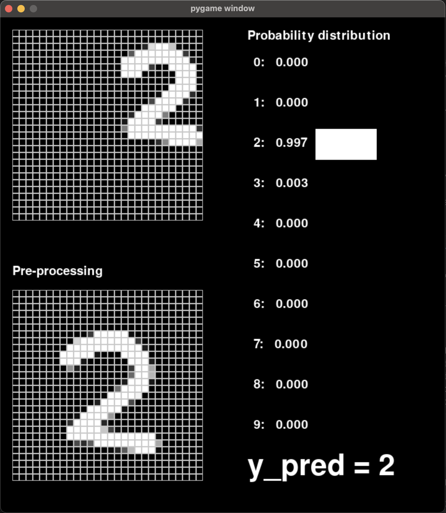

# Neural Network Digit Recognition from Scratch

A Python implementation of a neural network for handwritten digit recognition, built from scratch using NumPy. Features a real-time drawing interface for testing predictions.


## Features

- 🧠 Custom neural network implementation from scratch
- 🎨 Interactive drawing interface using Pygame
- 📊 Real-time probability distribution visualization
- 🔄 Live digit prediction as you draw
- 📐 Automatic input preprocessing and normalization

## Demo

### Live Prediction
The application provides real-time feedback as you draw:
- Left panel: Your drawing
- Bottom panel: Preprocessed input (normalized 28x28)
- Right panel: Probability distribution for each digit
- Bottom right: Final prediction



## Technical Details

### Neural Network Architecture
- Input layer: 784 neurons (28x28 flattened image)
- Hidden layers: 3 layers with ReLU activation
  - Layer 1: 20 neurons
  - Layer 2: 15 neurons
  - Layer 3: 15 neurons
- Output layer: 10 neurons with Softmax activation
- Loss function: Cross-entropy

### Performance
- Training accuracy: ~98%
- Test accuracy: ~97%
- Dataset: MNIST handwritten digits

## Installation

```bash
# Clone the repository
git clone https://github.com/yourusername/neural-network-digits.git

# Install dependencies
pip install numpy pygame

# Run the drawing interface
python display.py
```

## Usage

1. Run `display.py` to launch the drawing interface
2. Draw a digit using your mouse
3. Watch the real-time prediction
4. Press SPACE to clear the canvas
5. Close the window to exit

## Implementation Details

The project consists of several key components:

- `nn/nets.py`: Neural network implementation
- `nn/layers.py`: Layer abstractions (Dense, Input)
- `nn/activation_functions.py`: ReLU, Sigmoid, Softmax
- `nn/cost_functions.py`: MSE and Cross-entropy implementations
- `display.py`: Interactive drawing interface

## Contributing

Feel free to open issues and pull requests for improvements!

## License

MIT License - feel free to use this code for your own projects!