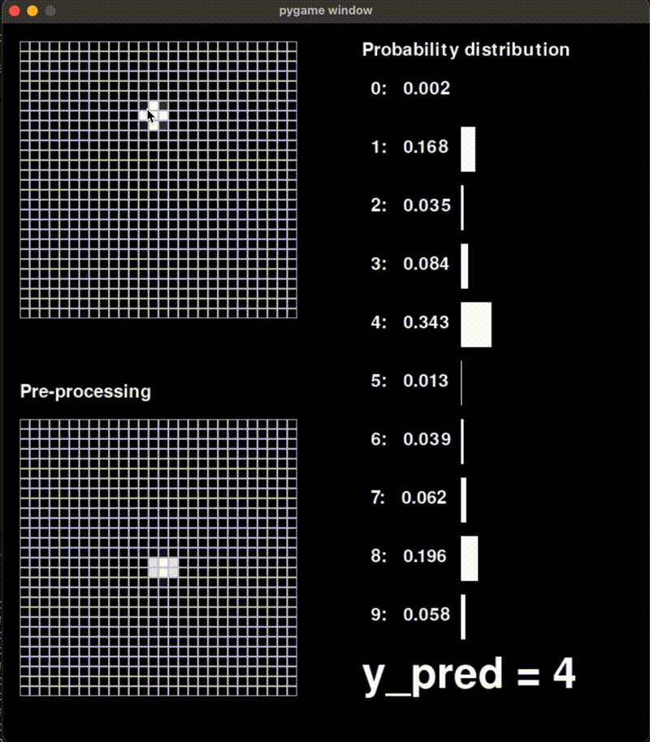

# Neural Network From Scratch: Handwritten Digit Recognition

A comprehensive neural network library built entirely from scratch using NumPy. This project implements backpropagation, gradient descent, and various activation functions to create a deep learning system capable of recognizing handwritten digits with ~96% accuracy.



## Core Features

### Neural Network Library
All core components implemented from scratch:
- 🧮 Backpropagation algorithm
- 📉 Mini-batch gradient descent
- 🔢 Multiple layer types (Dense, Input)
- ⚡ Activation functions (ReLU, Sigmoid, Softmax)
- 📊 Cost functions (MSE, Cross-entropy)
- 💾 Model saving and loading capabilities

### Interactive Demo
- 🎨 Real-time digit recognition interface
- 📐 Automatic input preprocessing and normalization
- 📊 Live probability distribution visualization
- 🔄 Instant predictions as you draw

## Technical Implementation

### Architecture
The network achieves 96% accuracy using a 3 hidden layer model:
```python
net = Net([
    InLayer(units=784),               # Flattened 28x28 input
    Dense(units=20, activation=ReLU), # Hidden layer 1
    Dense(units=15, activation=ReLU), # Hidden layer 2
    Dense(units=15, activation=ReLU), # Hidden layer 3
    Dense(units=10, activation=softmax) # Output layer
], cost_function=CrossEntropyLoss)
```

### Key Components
- **Backpropagation**: Custom implementation of the chain rule to compute gradients
- **Gradient Descent**: Mini-batch optimization with configurable learning rate and batch size
- **Activation Functions**: 
  - ReLU: `max(0, x)` for hidden layers
  - Softmax: For output layer probability distribution
- **Loss Function**: Cross-entropy loss for multi-class classification

## Performance
- Training accuracy: ~98.5%
- Test accuracy: ~95.7%
- Dataset: MNIST handwritten digits (60,000 training, 10,000 test images)

## Installation

```bash
# Clone the repository
git clone https://github.com/Benjamincf0/AI.git

# Install dependencies
conda create --name ai_project --file requirements.txt

# Run the interactive demo
python display.py
```

## Usage

### Interactive Demo
1. Run `python display.py`
2. Draw a digit using your mouse
3. Watch real-time predictions
4. Press **SPACE** to clear
5. Click the **X** to exit

### Training Your Own Model
```python
from nn.nets import Net
from nn.layers import Dense, InLayer
from nn.activation_functions import ReLU, softmax
from nn.cost_functions import CrossEntropyLoss

# Create model
net = Net([
    InLayer(units=784),
    Dense(units=20, activation=ReLU),
    Dense(units=10, activation=softmax),
], cost_function=CrossEntropyLoss)

# Get training data
X_train, Y_train = ...

# Train
net.gradient_descent(X_train, Y_train, 
                    alpha=0.0005,
                    epochs=3000, 
                    batch_size=256)

# Save model
net.save_model('my_model.npz')
```

## Project Structure
```
nn.ipynb
nn/
├── nets.py    # Neural network implementation
├── layers.py  # Layer abstractions
├── activation_functions.py
└── cost_functions.py
```

## License

MIT License - Feel free to use and modify!

## Contributing

Contributions are welcome! Feel free to open issues and pull requests.